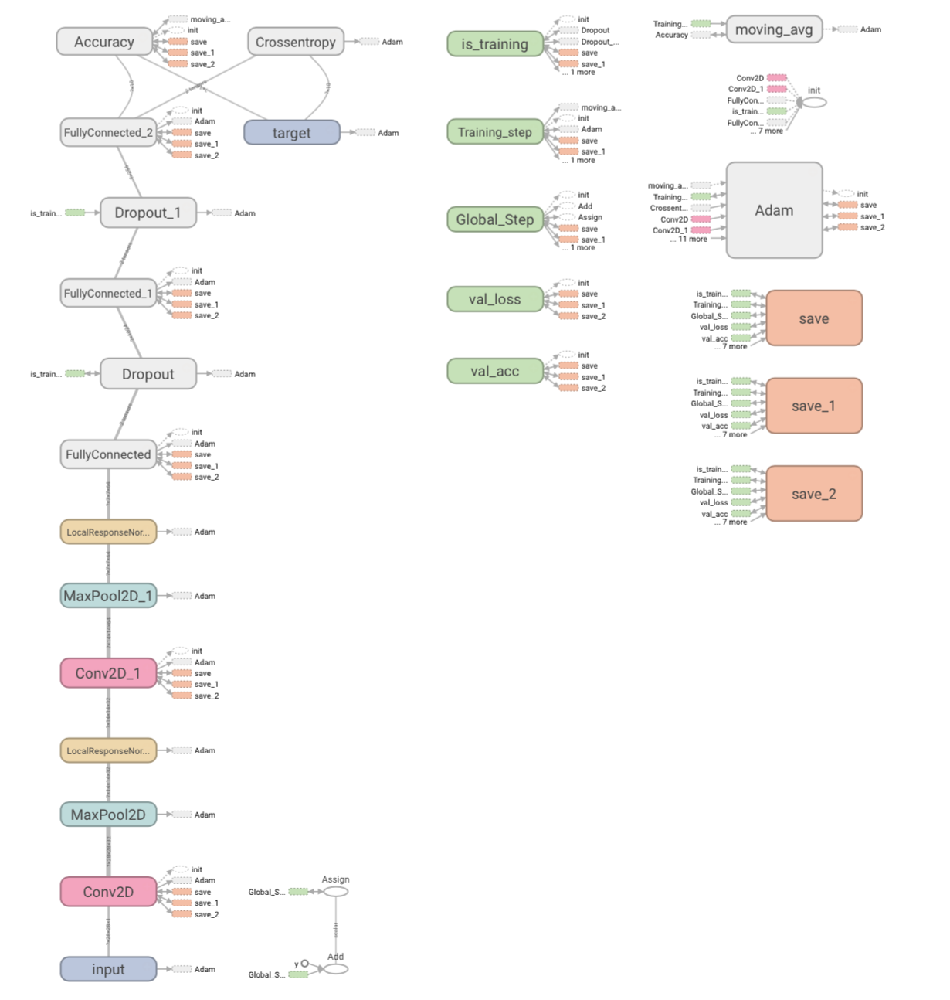

# Handwritten Number Prediction

Number Prediction Web Apps with tflearn, flask, d3.js

The CNN (3conv + 2fc) is trained on the MNIST dataset in tensorflow.
The recognition error on the test data set is 1.02% (9898/10000 classified correctly)

## Requirement

numpy, tensorflow, tflearn, flask

## Usage
```
$ python app.py
```

## NN Archtecture

